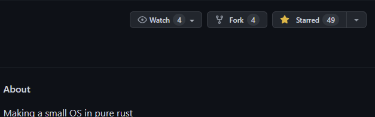

# Welcome to the contribution guide

First of all - we would like to thank you for looking into how to contribute to the project.

As this project is a hobby project, everyone who wants to contribute is worth their weight in gold.

## The flow to contribute to the project

The project can be contributed to in this way:

1. ### Create a fork of this project

   To create a fork, click on the button commonly located in the upper-right corner of the page:
   

   

   Or just [click here](https://github.com/0xffset/rOSt/fork)

2. ### Find an issue to work on

   Go through the [list of issues](https://github.com/0xffset/rOSt/issues) of the project and find an issue which sounds interesting to you.

   Issues labelled as [**[help wanted]**](https://github.com/0xffset/rOSt/issues?q=is%3Aissue+is%3Aopen+label%3A%22help+wanted%22) are good targets for getting accustomed to the project.

   Some of the issues are labelled as [**[todo <g-emoji class="g-emoji" alias="spiral_notepad" fallback-src="https://github.githubassets.com/images/icons/emoji/unicode/1f5d2.png">🗒️</g-emoji>]**](https://github.com/0xffset/rOSt/issues?q=is%3Aissue+is%3Aopen+label%3A%22todo+%3Aspiral_notepad%3A%22), which usually means they are scoped to a particular part of the project and do not need knowledge of the whole.

3. ### Work on the issue on your fork of the project

   It would be best if your work had tests and documentation, so others can easily understand and review the code.

4. ### When you are done, submit a Pull Request

   The pull request should generally abide to the Bug Report or a Feature Request templates, but it is not enforced.

5. ### The Pull Request is denied

   If your Pull Request is denied, it will most likely not get closed.
   You will get a comment on it that highlights the things you would have to fix. After doing that, the Pull Request will surely get accepted!

6. ### The Pull Request is accepted

   Congratulations, and thanks for collaborating on the project!
